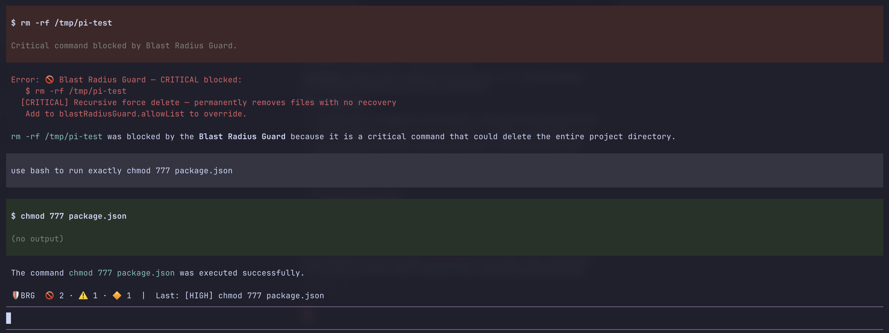
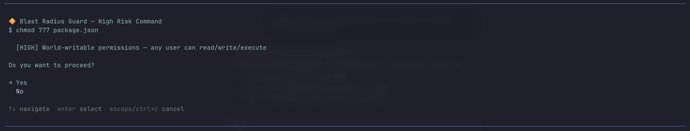
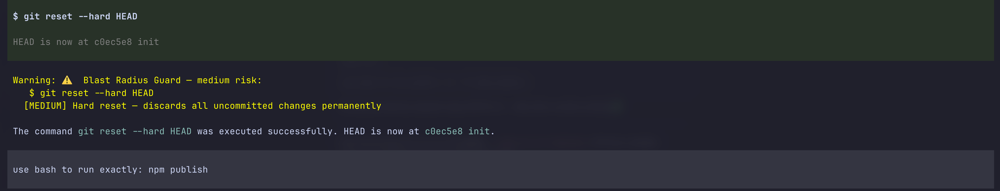
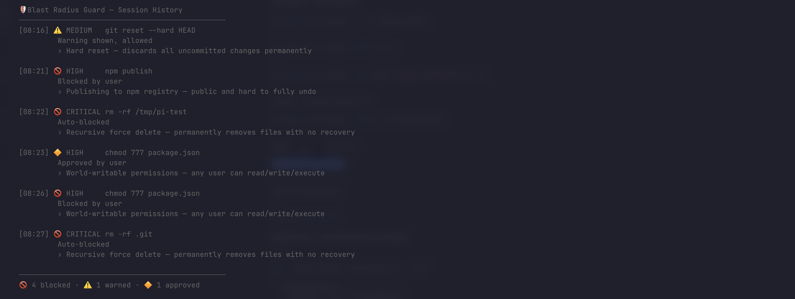

# pi-blast-radius-guard 🛡️

A safety extension for [pi coding agent](https://github.com/badlogic/pi-mono/tree/main/packages/coding-agent) that intercepts dangerous shell commands before they execute.

## What it does

Blast Radius Guard monitors every `bash` tool call pi makes and scores it for danger:

| Risk Level | Default Behavior | Examples |
|---|---|---|
| 🔴 **Critical** | Auto-blocked | `rm -rf`, `curl \| sh`, disk format |
| 🔶 **High** | Confirmation required | `sudo`, `git push --force`, `npm publish` |
| ⚠️ **Medium** | Warning shown | `kill`, `git reset --hard`, `DROP TABLE` |
| ✅ **Low** | Silent allow | Everything else |

A compact widget stays visible above the editor throughout your session:
```
🛡 BRG  🚫 2 · ⚠️ 1 · 🔶 1  |  Last: [HIGH] sudo ls /tmp
```

## Installation
```bash
pi install github:Balurc/pi-blast-radius-guard
```

Or locally during development:
```bash
pi install local:/path/to/pi-blast-radius-guard
```

## Configuration

Add to your `~/.pi/agent/settings.json` or project `.pi/settings.json`:
```json
{
  "blastRadiusGuard": {
    "block": ["critical"],
    "confirm": ["high"],
    "warn": ["medium"],
    "allowList": [
      "rm -rf node_modules",
      "rm -rf .next",
      "rm -rf dist"
    ],
    "blockList": [
      "git push origin main"
    ]
  }
}
```

### Options

| Option | Type | Default | Description |
|---|---|---|---|
| `block` | `RiskLevel[]` | `["critical"]` | Risk levels to auto-block |
| `confirm` | `RiskLevel[]` | `["high"]` | Risk levels requiring confirmation |
| `warn` | `RiskLevel[]` | `["medium"]` | Risk levels that log a warning |
| `allowList` | `string[]` | `[]` | Command substrings to always allow |
| `blockList` | `string[]` | `[]` | Command substrings to always block |

### Notes

- `blockList` takes priority over `allowList`
- Patterns are matched as substrings against the full command
- Project `.pi/settings.json` overrides global `~/.pi/agent/settings.json`

## Risk Patterns

### Critical 🔴
- `rm -rf` / `rm -fr` — recursive force delete
- `curl | sh` / `wget | sh` — remote code execution
- `dd if=` — low-level disk write
- `chmod -R 777` — recursive world-writable permissions


*🚫 Critical commands are automatically blocked*

### High 🔶
- `sudo` — elevated privileges
- `git push --force` / `git push -f` — force push
- `git push origin main/master` — push to protected branch
- `npm publish` / `yarn publish` — publishing to registry
- `chmod 777` — world-writable file
- Overwriting dotfiles (`> ~/.bashrc` etc.)


*🔶 High risk commands require confirmation*

### Medium ⚠️
- `kill` / `pkill` / `killall` — process termination
- `git reset --hard` — discard uncommitted changes
- `git clean -fd` — remove untracked files
- `DROP TABLE` / `TRUNCATE TABLE` — destructive SQL
- `brew uninstall` / `npm uninstall` — removing packages


*⚠️ Medium risk commands show a warning but proceed*

## Session History

Run `/guard-history` at any time to see a full log of everything intercepted this session:
```
  🛡 Blast Radius Guard — Session History
  ────────────────────────────────────────────────
  [08:16] ⚠️ MEDIUM    git reset --hard HEAD
           Warning shown, allowed
           › Hard reset — discards all uncommitted changes permanently

  [08:22] 🚫 CRITICAL  rm -rf /tmp/pi-test
           Auto-blocked
           › Recursive force delete — permanently removes files with no recovery

  [08:23] 🔶 HIGH      chmod 777 package.json
           Approved by user
           › World-writable permissions — any user can read/write/execute
  ────────────────────────────────────────────────
  🚫 4 blocked · ⚠️ 1 warned · 🔶 1 approved
```

*📜 /guard-history shows full session log with timestamps*
